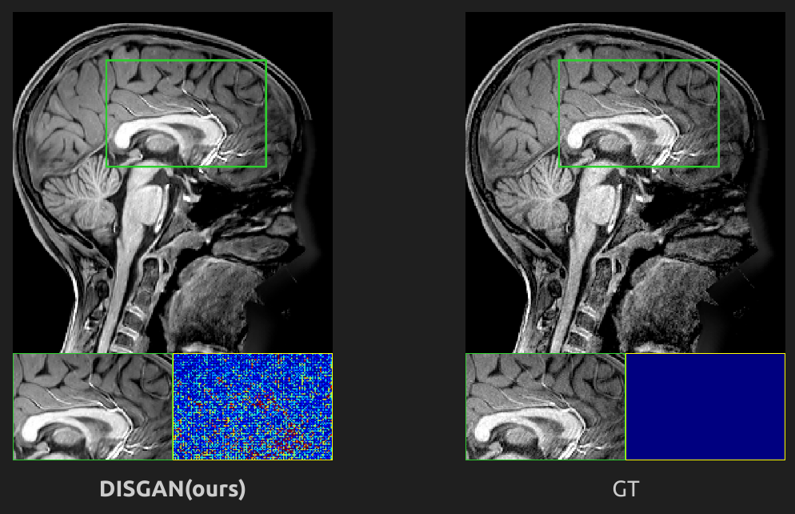
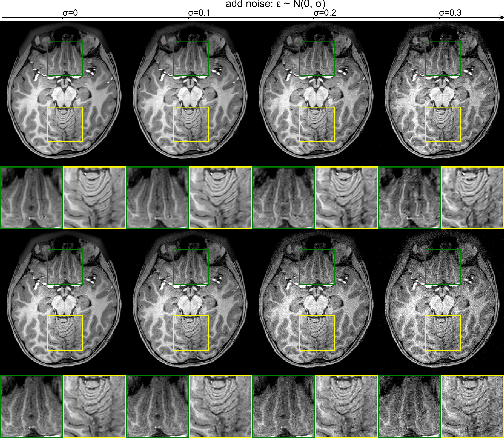

# [DISGAN: Wavelet-informed discriminator guides GAN to MRI Super-resolution with noise cleaning ](https://arxiv.org/abs/2308.12084)

@ICCV2023

- [Environment](#Environment)
- [Super-resolution](#Super-resolution)
- [Denoising](#denoising)
- [Train](#train-from-scratch)
- [Cite](#citation)
---
### Environment
Essentially required packaged:
* torch-dwt:
    1. `cd torch-dwt`
    2. `python -m pip install -e .`
* multiprocessing
* torch2
* pytorch-lightning

### Super-resolution

<figure id="sr" class=subfigure style="display: inline-block; width=50%">

<figcaption class=subcaption, style="text-align: center">GT</figcaption>
</figure>

### Denoising
<figure id="sim" class=subfigure style="display: inline-block; width=30%">

<figcaption class=subcaption><strong>Top:</strong>DISGAN(ours) for denoising; <strong>bottom:</strong>GT with noise</figcaption>
</figure>

### Train from scratch

1. Before training, change the directory path in the configuration files: `./mains/config/*.yml`
2. Patch the 3D whole brain volumes to HR patches, by executing the script of `./mains/utils/crop_nifti.py`
3. The LR patches will be simulated online while executing the trainig scirpt `./mains/ln_DDP_train.py` 
~~~bash
python ln_DDP_train.py --model_name 'DWT_D'
~~~

### Citation
~~~bibtex
@misc{wang2023disgan,
      title={DISGAN: Wavelet-informed Discriminator Guides GAN to MRI Super-resolution with Noise Cleaning}, 
      author={Qi Wang and Lucas Mahler and Julius Steiglechner and Florian Birk and Klaus Scheffler and Gabriele Lohmann},
      year={2023},
      eprint={2308.12084},
      archivePrefix={arXiv},
      primaryClass={eess.IV}
}
~~~
